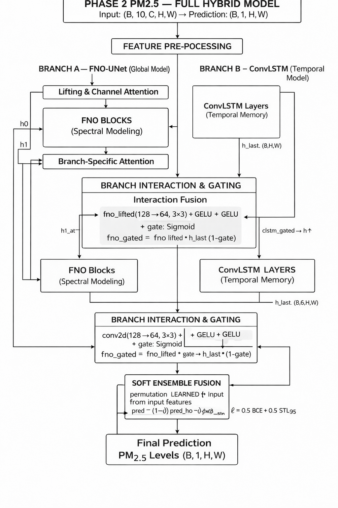

# PM2.5 Phase 2 — Spatio-Temporal Air Quality Forecasting

## Competition overview

Forecast PM2.5 concentration 16 hours ahead from 10 hours of lookback on a 140×124 grid. Inference only sees the lookback window (no future exogenous inputs).

## Model used in current runs (Exp06)

This repository supports two models: baseline `FNO2D` and a hybrid model `HybridFNOConvLSTMEnsemble`.

For the current Exp06 setup (`kaggle_notebook/exp06.ipynb`), the model used is:

- `model.name = hybrid_ensemble`
- `width = 64`
- `modes1 = 24`, `modes2 = 24`
- `convlstm_hidden = 64`

### Exp06 architecture diagram



## Data and preprocessing

### Input/output framing

- Grid: `140 x 124`
- Input window: `time_input = 10` hours
- Forecast horizon: `time_out = 16` hours
- Sliding window horizon used in dataset: `horizon = 26` (`10 + 16`)

### Raw channels from competition files

16 raw channels are loaded from `<MONTH>/*.npy`:

- Meteorology + PM2.5: `cpm25, q2, t2, u10, v10, swdown, pblh, psfc`
- Persisted met for physics features: `rain`
- Emissions: `PM25, NH3, SO2, NOx, NMVOC_e, NMVOC_finn, bio`

### Derived channels (causal, in-window only)

13 derived channels are computed in `src/utils/preprocessing.py`:

- Wind/rain/daylight: `wind_speed, wind_dir_cos, wind_dir_sin, rain_occ, rain_amt, daylight_mask`
- PM2.5 temporal features: `cpm25_delta1, cpm25_delta3, cpm25_mean3, cpm25_mean6, cpm25_std10`
- Boundary-layer/dispersion: `pblh_inverse, ventilation_proxy`

### Normalization

`scripts/preprocess_data.py` fits train-only feature normalization and saves `normalization_stats.json`.

- `log1p + robust`: `cpm25, PM25, NH3, SO2, NOx, NMVOC_e, NMVOC_finn, bio`
- `identity + robust`: `u10, v10, pblh, rain`
- `identity + standard`: `q2, t2, swdown, psfc`

At train/infer time, `RawWindowDataset` and `TestRawDataset` load these stats (if configured under `preprocessing.stats_path`) and apply normalization before feature construction.

## Architecture details

### 1) FNO branch

- Lifts flattened spatio-temporal channels (plus 2D positional grid)
- 3 spectral blocks (`FNOBlock`) with Fourier convolution + pointwise conv
- Attention blocks (`SE` and `CBAM`) and UNet-style decoder
- Produces `pred_fno` of shape `(B, T_out, H, W)`

### 2) ConvLSTM branch

- 3-layer ConvLSTM stack over dynamic channels
- Additional physically motivated channels are injected:
	- wind divergence
	- `PM25 / pblh` proxy
	- positional grid
- Spatial-attention decoder produces `pred_clstm`

### 3) Adaptive fusion + episode head

- Gated cross-branch interaction fuses FNO and ConvLSTM context
- Episode head predicts episode probability map `ep_prob`
- Final forecast is blended per-pixel:
	- `pred = (1 - ep_prob) * pred_fno + ep_prob * pred_clstm`

## Training details

Training entrypoint: `scripts/train.py`

- Dataset: `RawWindowDataset` with `month_holdout` split (`val_months` from config)
- Optimizer: custom `Adam` (`src/utils/adam.py`)
- LR schedule: `StepLR(step_size=scheduler_step, gamma=scheduler_gamma)`
- Optional AMP (`training.use_amp`) + grad clipping (`training.grad_clip_norm`)
- Checkpoints: `best.pt` and `last.pt`, with optional periodic snapshots and live sync

### Loss for hybrid model

- Main loss: episode-weighted SMAPE (`episode_weighted_smape_loss`)
- Auxiliary loss: BCE for episode head (`ep_prob` vs proxy episode mask)
- Total loss:

`hybrid_total = main_smape + ep_head_weight * episode_bce`

### Episode curriculum (Exp06)

- `alpha = 1.0` (warmup)
- `alpha = 5.0` from epoch `20`
- `alpha = 8.0` from epoch `50`
- `ep_head_weight = 0.1`

## Validation metrics and `val_score`

Validation logs include:

- `val_GlobalSMAPE`
- `val_EpisodeSMAPE`
- `val_EpisodeCorr`
- `val_score` (offline surrogate)

`val_score` is computed from normalized metric components using local weights (`offline_metric_w1/w2/w3`, default equal weights). It is useful for model selection, but final leaderboard score can still differ because competition test splits and hidden/private evaluation differ from local validation.

## Inference

Inference entrypoint: `scripts/infer.py`

- Rebuilds exact same feature stack as training
- Loads `best.pt` (or any checkpoint)
- Runs model on `test_in`
- Saves `preds.npy` with expected shape `(218, 140, 124, 16)`

For hybrid inference, `model.infer_season_idx` can be set in config.

## Quick start

```bash
pip install -r requirements.txt
cd Ronit_new

# (Optional) fit normalization stats
python scripts/preprocess_data.py --config configs/train.yaml --raw_root /path/to/competition/raw

# Train
python scripts/train.py --config configs/train.yaml --raw_path /path/to/competition/raw

# Infer
python scripts/infer.py --config configs/infer.yaml --model_path /path/to/best.pt --input_loc /path/to/test_in --output_loc /path/to/out/
```

On Kaggle, use `kaggle_notebook/exp06.ipynb` for the current hybrid run template (runtime YAML patching + preprocess + train + infer).

## Layout

```
├── configs/          train.yaml, infer.yaml
├── models/           fno2d.py, ensemble.py
├── scripts/          preprocess_data.py, train.py, infer.py
├── src/
│   ├── data/         raw_window_dataset.py
│   └── utils/        config, preprocessing, competition_metrics, optim, losses
├── kaggle_notebook/  exp06.ipynb, exp06_dual.ipynb
├── experiments/      checkpoints / logs
└── submissions/      preds outputs
```

## Kaggle dataset push

```bash
cd /path/to/Ronit_new
make push MSG="describe what changed"
```

First time only: `make push-create` (requires `kaggle.json` and Kaggle CLI).

## Requirements note

Install PyTorch separately for your CUDA/CPU platform ([pytorch.org](https://pytorch.org)) if `pip install -r requirements.txt` does not pull the right wheel.
